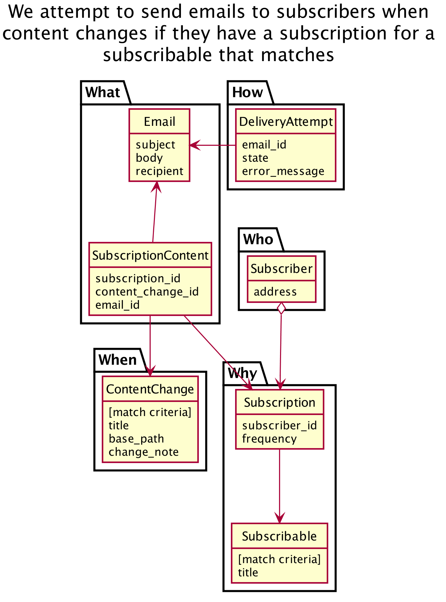

## Email Alert API's Domain Model

This document gives an overview of the high-level concepts in email-alert-api.

The diagram is generated with [plantuml](http://brewformulas.org/Plantuml).

## Diagram



## Explanation

**Overview**

The diagram is split into four sections. The highlighted class in each section
should probably abstract over the other classes in that section.

For example, to create a subscription for something, that should probably be
done through the subscriber object:

```ruby
subscriber.subscribe_to(matchable_content)
```

It's not essential, but this helps keep things simple as as there are clearer
boundaries between different parts of the system.

**What we send**

We send emails to subscribers for things they've subscribed to
(matchable_content). These emails are sent in response to notable events such as
a 'major' change to content.

An email is sent to a single subscriber but might contain information relating
to multiple things if they've opted to receive digest emails.

**Things that trigger emails**

Notable events, such as a 'major' change to content trigger emails to be sent.
We might also need to trigger emails for changes to the taxonomy.

**How you subscribe**

Subscribers create subscriptions for matchable content. They can set up
preferences. A delivery preference is specific to a subscription and controls
whether emails are delivered immediately or as part of a daily/weekly digest.

**What you can subscribe to**

You can subscribe to a set of links, which might refer to organisations,
policies, taxons, etc. We might need to offer subscriptions for single pieces
of content, too.
